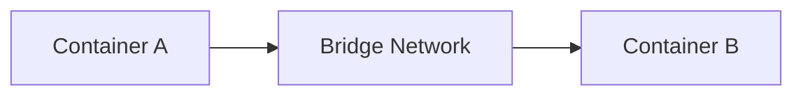

# 📝 How to Publish a New Blog Post

This guide explains how to add a new markdown blog post to the portfolio website and raise a PR for it.

---

## Quick Steps

1. **Create your markdown file** in `public/content/blogs/`
2. **Run the sync script** to generate metadata
3. **Verify locally** on `localhost:8080`
4. **Commit, push, and raise a PR**

---

## Step 1: Create the Markdown File

Create a new `.md` file inside:

```
public/content/blogs/
```

### File naming

Use **kebab-case** with a descriptive slug. This slug becomes the URL.

```
public/content/blogs/my-new-topic-blog.md
```

This will be accessible at: `https://yoursite.com/blog/my-new-topic-blog`

### Frontmatter (required)

Every blog file **must** start with a YAML frontmatter block:

```yaml
---
title: "Your Blog Title Here"
date: "2026-06-15"
description: "A short summary of the blog. This appears in the article card on the /articles page."
tags: ["Tag1", "Tag2", "Tag3"]
image: ""
---
```

| Field         | Required | Description                                                                 |
|---------------|----------|-----------------------------------------------------------------------------|
| `title`       | ✅ Yes    | Displayed as the blog heading and card title                                |
| `date`        | ✅ Yes    | Format: `YYYY-MM-DD`. Used for sorting (newest first)                       |
| `description` | ✅ Yes    | Shows on the article card. Keep it 1-2 sentences                            |
| `tags`        | ✅ Yes    | Array of tag strings. First 3 tags appear on the card                       |
| `image`       | Optional | URL or path to a hero image. Leave `""` if none                             |

### Blog content (after the frontmatter)

Write standard markdown. The renderer supports:

- **Headings** (`## H2`, `### H3`, etc.)
- **Code blocks** with syntax highlighting (use triple backticks + language)
- **Mermaid diagrams** (use triple backticks with `mermaid` as the language)
- **Tables** (standard markdown tables, scrollable on mobile)
- **Blockquotes**, **lists**, **bold/italic**, **links**, **images**

### Example: minimal blog file

```markdown
---
title: "Understanding Docker Networking"
date: "2026-06-15"
description: "A practical guide to Docker bridge, host, and overlay networks."
tags: ["Docker", "Networking", "DevOps"]
image: ""
---

## Introduction

Docker provides several networking modes...

### Bridge Network

```bash
docker network create my-bridge
```

### Mermaid Diagram



## Conclusion

Choose the right network mode for your use case.
```

---

## Step 2: Run the Sync Script

After creating or editing a markdown file, **regenerate the blog index** so the site knows about it:

```bash
npm run sync:articles
```

This runs `scripts/sync-blogs.mjs` which:
- Scans all `.md` files in `public/content/blogs/`
- Parses their frontmatter
- Generates `src/data/local-blogs.generated.ts` (auto-generated, don't edit manually)

> **Note:** This also runs automatically during `npm run build` (via `prebuild` hook), so the production deploy always picks up new blogs.

---

## Step 3: Verify Locally

Start the dev server (if not already running):

```bash
npm run dev
```

Then check:

1. **Articles page** → `http://localhost:8080/articles` — your new blog should appear as a card
2. **Blog page** → `http://localhost:8080/blog/<your-slug>` — the full rendered blog post
3. **Theme toggle** → Verify it looks good in both light and dark mode
4. **Mobile view** → Resize the browser to check responsive tables and Mermaid diagrams

---

## Step 4: Commit and Raise a PR

### Branch naming

```bash
git checkout -b blog/my-new-topic-blog
```

### Files to commit

You need to commit **exactly these files** for a new blog:

| File | Why |
|------|-----|
| `public/content/blogs/<slug>.md` | Your actual blog content |
| `src/data/local-blogs.generated.ts` | Auto-generated index (from Step 2) |

### Commit message

```bash
git add public/content/blogs/<slug>.md src/data/local-blogs.generated.ts
git commit -m "blog: add <short-topic-description>"
git push origin blog/my-new-topic-blog
```

### PR description template

```markdown
## New Blog Post

**Title:** <Your Blog Title>
**URL:** /blog/<your-slug>

### Checklist
- [ ] Frontmatter has title, date, description, tags
- [ ] `npm run sync:articles` was run
- [ ] Blog renders correctly at `/blog/<slug>`
- [ ] Mermaid diagrams (if any) render properly
- [ ] Code blocks have correct language tags
- [ ] Looks good in both dark and light mode
- [ ] Tables are scrollable on mobile
```

---

## Supported Markdown Features

| Feature | Syntax | Notes |
|---------|--------|-------|
| Code blocks | ` ```python ` | macOS-styled with line numbers, copy button, language badge |
| Mermaid diagrams | ` ```mermaid ` | Flowcharts, sequence diagrams, etc. Auto-rendered |
| Tables | Standard markdown tables | Horizontally scrollable on mobile |
| Blockquotes | `> text` | Styled with left border |
| Inline code | `` `code` `` | Highlighted with primary color |
| Images | `` | Rounded corners |
| Links | `[text](url)` | Standard links |
| Lists | `- item` or `1. item` | Ordered and unordered |

---

## Troubleshooting

| Problem | Solution |
|---------|----------|
| Blog doesn't appear on `/articles` | Run `npm run sync:articles` and check the generated file |
| Mermaid diagram not rendering | Check syntax at [mermaid.live](https://mermaid.live) first |
| `[object Object]` in tables | Make sure tables use standard markdown pipe syntax |
| Blog shows 404 | Verify the `.md` filename matches the slug exactly |
| Code block has no syntax highlighting | Add the language after triple backticks (e.g. ` ```python `) |
| Blog not appearing in production | Ensure `src/data/local-blogs.generated.ts` is committed |

---

## Architecture Overview

```
public/content/blogs/*.md          ← You write blogs here
        ↓
scripts/sync-blogs.mjs             ← Parses frontmatter, generates index
        ↓
src/data/local-blogs.generated.ts  ← Auto-generated blog metadata
        ↓
src/pages/Articles.tsx             ← Shows blog cards on /articles
src/pages/BlogPost.tsx             ← Renders full blog at /blog/<slug>
```
