> **Goal:** Understand how microservices find and call each other, when `http://service-name:8080` works, how Kubernetes replaces Eureka-style service registry in many systems, and when tools like Istio, Linkerd, Consul, Kuma, or Cilium are worth adding.

---

## Table of Contents

1. [The simple mental model](#1-the-simple-mental-model)
2. [What problem does a service registry solve?](#2-what-problem-does-a-service-registry-solve)
3. [Old style: Eureka-style service registration](#3-old-style-eureka-style-service-registration)
4. [Kubernetes-native service discovery](#4-kubernetes-native-service-discovery)
5. [When does `http://service-name:8080` work?](#5-when-does-httpservice-name8080-work)
6. [Register a microservice without Eureka](#6-register-a-microservice-without-eureka)
7. [Gateway vs Kubernetes Service Discovery](#7-gateway-vs-kubernetes-service-discovery)
8. [Using simple HTTP with Kubernetes discovery](#8-using-simple-http-with-kubernetes-discovery)
9. [Service mesh: what it adds on top](#9-service-mesh-what-it-adds-on-top)
10. [Istio deep dive](#10-istio-deep-dive)
11. [Linkerd, Consul, Kuma, Cilium: when to use which](#11-linkerd-consul-kuma-cilium-when-to-use-which)
12. [Decision table: native K8s vs gateway vs mesh vs Eureka](#12-decision-table-native-k8s-vs-gateway-vs-mesh-vs-eureka)
13. [Common production mistakes](#13-common-production-mistakes)
14. [End-to-end recommended architecture](#14-end-to-end-recommended-architecture)

---

## 1. The simple mental model

In microservices, one service usually needs to call another service.

Example:

```text
Order Service wants to call Payment Service.
```

The problem is that `Payment Service` may have many running instances:

```text
payment-service pod 1 -> 10.1.1.21
payment-service pod 2 -> 10.1.2.43
payment-service pod 3 -> 10.1.3.89
```

These IPs are temporary. Pods can restart, move to another node, scale up, or scale down. So your code should **not** hardcode pod IPs.

Instead of this:

```python
PAYMENT_URL = "http://10.1.1.21:8080"  # bad
```

Use this inside Kubernetes:

```python
PAYMENT_URL = "http://payment-service:8080"  # good, if same namespace and service port is 8080
```

### Main idea

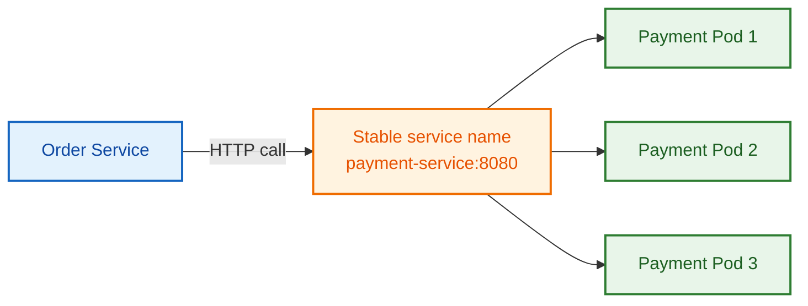

`payment-service` is the stable name. Kubernetes resolves it to the right backing pods.

---

## 2. What problem does a service registry solve?

A **service registry** answers this question:

> “Where is the current healthy instance of this service?”

Without a registry, services would need to know each other’s IPs manually.

### The core responsibilities

| Responsibility | Meaning | Example |
|---|---|---|
| Registration | Service instance announces itself | `payment-service instance 1 is alive` |
| Discovery | Caller asks where target service lives | `where is payment-service?` |
| Health | Unhealthy instances should not receive traffic | remove failed pod from endpoints |
| Load balancing | Traffic is distributed across instances | send traffic to pod 1, 2, 3 |
| Deregistration | Dead/removed instance disappears | pod deleted -> endpoint removed |

### Simple visual

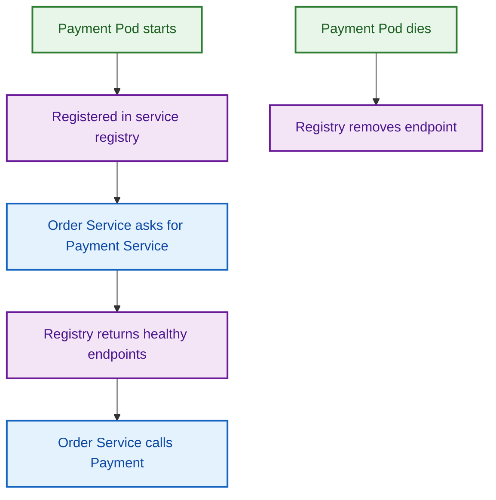

---

## 3. Old style: Eureka-style service registration

Before Kubernetes became common, many Spring Boot microservice systems used **Netflix Eureka**.

In that model:

1. Each service starts.
2. It registers itself with Eureka Server.
3. Other services ask Eureka for target service instances.
4. The client picks one instance and calls it.

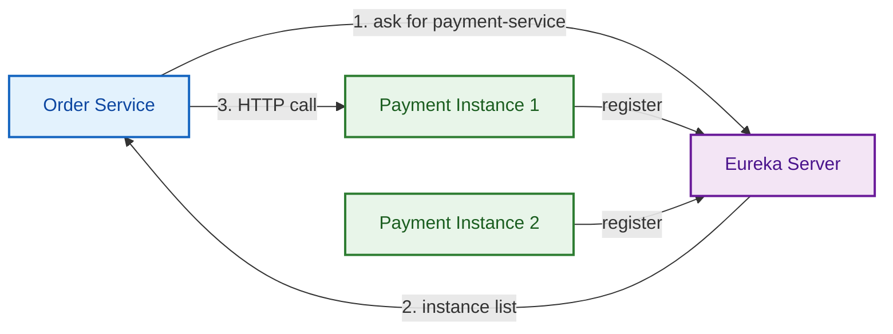

### Eureka-style Python analogy

This is not production-grade Eureka code. It is just a simple mental model.

```python
# fake_service_registry.py

registry = {}


def register(service_name: str, instance_url: str) -> None:
    registry.setdefault(service_name, []).append(instance_url)


def discover(service_name: str) -> list[str]:
    return registry.get(service_name, [])


register("payment-service", "http://10.1.1.21:8080")
register("payment-service", "http://10.1.2.43:8080")

instances = discover("payment-service")
print(instances)
```

Output:

```text
['http://10.1.1.21:8080', 'http://10.1.2.43:8080']
```

### When Eureka still makes sense

| Case | Eureka useful? | Why |
|---|---:|---|
| Spring Boot apps outside Kubernetes | Yes | No Kubernetes Service/DNS layer |
| Legacy JVM microservices | Yes | Existing Spring Cloud integration |
| VM-based deployment | Yes | Apps need a registry |
| All services inside Kubernetes | Usually no | Kubernetes already gives Service discovery |
| Mixed Kubernetes + VM | Maybe | Consul is often stronger for hybrid discovery |

### Key point

If your microservices run inside Kubernetes, you usually do **not** need every service to register itself in Eureka. Kubernetes already tracks pods and exposes them through `Service` and DNS.

---

## 4. Kubernetes-native service discovery

Kubernetes gives service discovery through these building blocks:

| Kubernetes object/component | Role |
|---|---|
| `Pod` | Runs your container |
| `Deployment` | Creates and manages replicas of pods |
| `Service` | Gives a stable virtual IP and DNS name |
| `EndpointSlice` | Tracks actual pod IPs behind a Service |
| `CoreDNS` | Resolves service names like `payment-service` |
| `kube-proxy` / CNI / eBPF datapath | Routes traffic to backend pods |

### Kubernetes service discovery flow

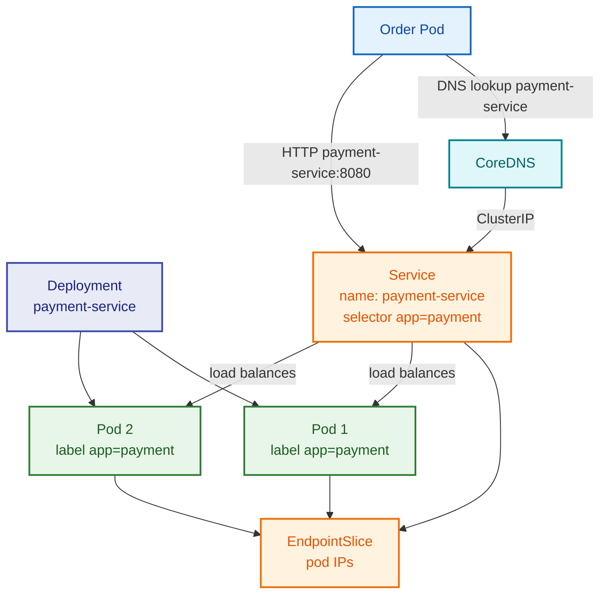

### Important point

Your application does **not** register itself manually.

You register the service by creating a Kubernetes `Service` object.

Kubernetes automatically keeps the backing endpoint list updated based on pod labels and readiness.

---

## 5. When does `http://service-name:8080` work?

This is one of the most important parts.

`http://service-name:8080` works when:

1. Caller and target service are in the **same Kubernetes namespace**.
2. A Kubernetes `Service` exists with name `service-name`.
3. That `Service` exposes port `8080`.
4. Caller is running inside the Kubernetes cluster.
5. NetworkPolicy or service mesh policy is not blocking it.

### Same namespace

If both `order-service` and `payment-service` are in the `default` namespace:

```python
PAYMENT_URL = "http://payment-service:8080"
```

### Different namespace

If `payment-service` is in namespace `payments` and `order-service` is in namespace `orders`:

```python
PAYMENT_URL = "http://payment-service.payments.svc.cluster.local:8080"
```

Usually this shorter form also works:

```python
PAYMENT_URL = "http://payment-service.payments:8080"
```

### DNS name formats

| Caller location | Target name to use |
|---|---|
| Same namespace | `http://payment-service:8080` |
| Different namespace | `http://payment-service.payments:8080` |
| Fully qualified | `http://payment-service.payments.svc.cluster.local:8080` |
| From laptop/browser directly | Does not work unless exposed/port-forwarded |

### Service port vs container port

This part confuses many people.

```yaml
ports:
  - port: 80
    targetPort: 8080
```

In this case, callers use:

```text
http://payment-service:80
```

Not:

```text
http://payment-service:8080
```

Because `port` is the Service port. `targetPort` is the container port.

---

## 6. Register a microservice without Eureka

Let’s build this properly.

We will create:

1. `payment-service` deployment
2. `payment-service` Kubernetes Service
3. `order-service` deployment that calls `payment-service`

### Payment Service Deployment

```yaml
apiVersion: apps/v1
kind: Deployment
metadata:
  name: payment-service
  labels:
    app: payment-service
spec:
  replicas: 2
  selector:
    matchLabels:
      app: payment-service
  template:
    metadata:
      labels:
        app: payment-service
    spec:
      containers:
        - name: payment-service
          image: your-docker-registry/payment-service:1.0.0
          ports:
            - containerPort: 8080
          readinessProbe:
            httpGet:
              path: /health
              port: 8080
            initialDelaySeconds: 5
            periodSeconds: 10
          livenessProbe:
            httpGet:
              path: /health
              port: 8080
            initialDelaySeconds: 15
            periodSeconds: 20
```

### Payment Service registration through Kubernetes Service

```yaml
apiVersion: v1
kind: Service
metadata:
  name: payment-service
spec:
  type: ClusterIP
  selector:
    app: payment-service
  ports:
    - name: http
      port: 8080
      targetPort: 8080
```

This `Service` is your Kubernetes-native service registry entry.

You did not write Eureka registration code. You created a Kubernetes Service.

### Order Service Deployment

```yaml
apiVersion: apps/v1
kind: Deployment
metadata:
  name: order-service
  labels:
    app: order-service
spec:
  replicas: 2
  selector:
    matchLabels:
      app: order-service
  template:
    metadata:
      labels:
        app: order-service
    spec:
      containers:
        - name: order-service
          image: your-docker-registry/order-service:1.0.0
          ports:
            - containerPort: 8080
          env:
            - name: PAYMENT_SERVICE_URL
              value: "http://payment-service:8080"
```

### Python HTTP client inside Order Service

```python
import os
from typing import Any

import httpx
from fastapi import FastAPI, HTTPException

app = FastAPI()

PAYMENT_SERVICE_URL = os.getenv(
    "PAYMENT_SERVICE_URL",
    "http://payment-service:8080",
)


@app.post("/orders")
async def create_order(payload: dict[str, Any]) -> dict[str, Any]:
    order_id = payload.get("order_id")
    amount = payload.get("amount")

    if not order_id or not amount:
        raise HTTPException(status_code=400, detail="order_id and amount are required")

    payment_payload = {
        "order_id": order_id,
        "amount": amount,
    }

    try:
        async with httpx.AsyncClient(timeout=2.0) as client:
            response = await client.post(
                f"{PAYMENT_SERVICE_URL}/payments",
                json=payment_payload,
                headers={"Idempotency-Key": f"payment-{order_id}"},
            )
            response.raise_for_status()
    except httpx.TimeoutException:
        raise HTTPException(status_code=504, detail="Payment service timeout")
    except httpx.HTTPStatusError as exc:
        raise HTTPException(
            status_code=502,
            detail=f"Payment service failed: {exc.response.text}",
        )
    except httpx.RequestError as exc:
        raise HTTPException(status_code=503, detail=f"Payment service unavailable: {exc}")

    return {
        "order_id": order_id,
        "status": "CREATED",
        "payment": response.json(),
    }
```

### Test from inside the cluster

```bash
kubectl run curl-test --image=curlimages/curl -it --rm -- sh
```

Inside that temporary pod:

```bash
curl http://payment-service:8080/health
```

If the service is in a different namespace:

```bash
curl http://payment-service.payments.svc.cluster.local:8080/health
```

### Check endpoints

```bash
kubectl get svc payment-service
kubectl get endpoints payment-service
kubectl get endpointslice -l kubernetes.io/service-name=payment-service
```

If endpoints are empty, your Service selector probably does not match pod labels.

---

## 7. Gateway vs Kubernetes Service Discovery

This is where many people get confused.

### Gateway is for north-south traffic

North-south means traffic entering the cluster from outside.

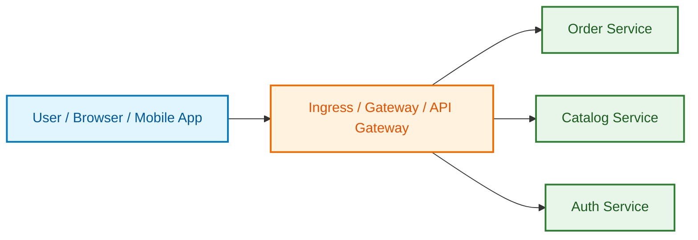

Examples:

```text
https://api.example.com/orders
https://api.example.com/catalog
https://api.example.com/login
```

Use gateway for:

| Need | Gateway helps? |
|---|---:|
| External client access | Yes |
| TLS termination | Yes |
| Public routing rules | Yes |
| Auth at edge | Yes |
| Rate limiting | Yes, depending on gateway |
| Request aggregation | Yes, API Gateway/BFF layer |
| Internal service-to-service calls | Usually no |

### Kubernetes Service discovery is for east-west traffic

East-west means service-to-service traffic inside the cluster.

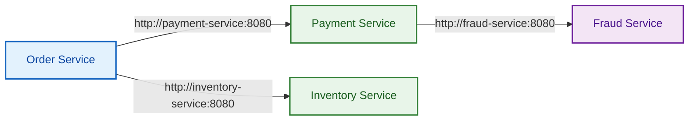

Use Kubernetes service discovery for:

| Need | K8s Service discovery helps? |
|---|---:|
| Internal service calls | Yes |
| Stable DNS name | Yes |
| Pod scaling | Yes |
| Basic load balancing | Yes |
| Replacing Eureka inside K8s | Usually yes |
| Advanced mTLS/policy/traffic split | Not by itself |

### Should internal services call each other through the gateway?

Usually **no**.

Bad internal design:

```text
Order Service -> API Gateway -> Payment Service
```

Better internal design:

```text
Order Service -> payment-service.default.svc.cluster.local
```

Why avoid gateway for normal internal calls?

| Problem | Explanation |
|---|---|
| Extra hop | More latency and more failure points |
| Wrong responsibility | Gateway is mainly edge entry, not every internal call |
| Bottleneck risk | Gateway becomes central internal dependency |
| Complex routing | Internal services already have Kubernetes DNS |

### When internal calls through gateway can make sense

| Case | Why |
|---|---|
| BFF/API composition | Gateway combines multiple services for frontend |
| Strong central auth requirement | Some organizations enforce all calls through gateway |
| Cross-cluster public API | Service is consumed as an external API |
| Partner/internal platform API | Gateway acts as productized API boundary |

For normal microservice-to-microservice communication inside one Kubernetes cluster, prefer native service discovery.

---

## 8. Using simple HTTP with Kubernetes discovery

You do not need service mesh on day one.

A simple and good starting architecture is:

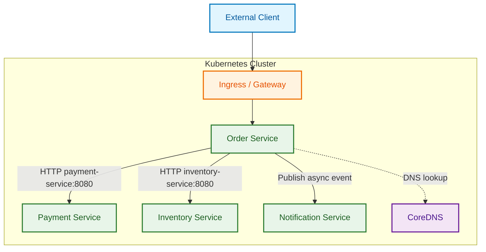

### Use simple HTTP + Kubernetes discovery when

| Situation | Good choice? | Why |
|---|---:|---|
| Small to medium microservice system | Yes | Less operational complexity |
| Same Kubernetes cluster | Yes | Native DNS works well |
| Basic internal calls | Yes | `http://service-name:port` is enough |
| Team can implement timeouts/retries in code | Yes | No need for mesh yet |
| You do not require strict service-to-service mTLS | Yes | Avoid extra mesh complexity |
| You need per-route traffic split/canary/mTLS by identity | Maybe not | Mesh may help |

### Minimum production checklist for simple HTTP

Even without mesh, do these:

| Requirement | How to do it |
|---|---|
| Timeout | Add client-side timeout in code |
| Retry carefully | Retry only safe/idempotent operations |
| Idempotency key | Especially for payment/order operations |
| Readiness probe | Prevent traffic to unready pods |
| Liveness probe | Restart broken pods |
| Metrics | Prometheus/OpenTelemetry/app metrics |
| Logs | Structured logs with correlation ID |
| NetworkPolicy | Restrict which services can talk |
| Resource limits | Avoid noisy-neighbor issues |

### Python client with retries and backoff

Keep retries small. Never retry blindly on payments unless the API is idempotent.

```python
import asyncio
import os
from typing import Any

import httpx

PAYMENT_SERVICE_URL = os.getenv("PAYMENT_SERVICE_URL", "http://payment-service:8080")


async def call_payment_service(order_id: str, amount: float) -> dict[str, Any]:
    payload = {"order_id": order_id, "amount": amount}
    headers = {"Idempotency-Key": f"payment-{order_id}"}

    retry_delays = [0.1, 0.3, 0.7]

    async with httpx.AsyncClient(timeout=2.0) as client:
        for attempt, delay in enumerate(retry_delays, start=1):
            try:
                response = await client.post(
                    f"{PAYMENT_SERVICE_URL}/payments",
                    json=payload,
                    headers=headers,
                )

                if response.status_code < 500:
                    response.raise_for_status()
                    return response.json()

            except (httpx.TimeoutException, httpx.ConnectError):
                pass

            if attempt == len(retry_delays):
                break

            await asyncio.sleep(delay)

    raise RuntimeError("Payment service failed after retries")
```

### Avoid this retry mistake

```python
# Bad: infinite retry can overload a struggling service
while True:
    call_payment_service()
```

Better:

```python
# Good: bounded retries + timeout + idempotency
retry_delays = [0.1, 0.3, 0.7]
```

---

## 9. Service mesh: what it adds on top

A **service mesh** is an infrastructure layer for service-to-service communication.

Your app still calls:

```text
http://payment-service:8080
```

But the traffic is intercepted by a proxy/data plane that adds security, observability, and traffic control.

### Without service mesh

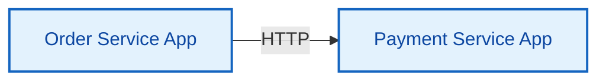

Your application code handles:

```text
TLS
Retries
Timeouts
Metrics
Tracing
Authorization
Traffic splitting
```

### With sidecar-based service mesh

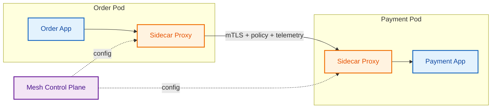

### What service mesh gives you

| Capability | Why it matters |
|---|---|
| mTLS | Encrypts and authenticates service-to-service traffic |
| Service identity | Policy can be based on workload identity, not just IP |
| Traffic splitting | Canary, blue-green, A/B testing |
| Retries/timeouts | Consistent traffic behavior without app changes |
| Circuit breaking/outlier detection | Avoid calling unhealthy backends |
| Observability | Metrics, traces, service graph |
| Authorization policy | Control which service can call which service |
| Multi-cluster support | Connect services across clusters, depending on tool |

### What service mesh does not replace

| Thing | Does mesh replace it? | Why |
|---|---:|---|
| Kubernetes Service | No | Mesh still uses service discovery underneath |
| API Gateway | No | Gateway handles external client traffic |
| Business logic | No | App still owns behavior |
| Good API design | No | Mesh cannot fix bad contracts |
| Async messaging | No | Mesh is mostly request/response traffic management |
| Database transactions | No | Use saga/outbox/idempotency patterns |

---

## 10. Istio deep dive

Istio is one of the most feature-rich service meshes.

It is useful when you want:

```text
mTLS
AuthorizationPolicy
Traffic splitting
Canary release
Retries and timeouts
Observability
Ingress gateway
Multi-cluster options
```

### Istio architecture

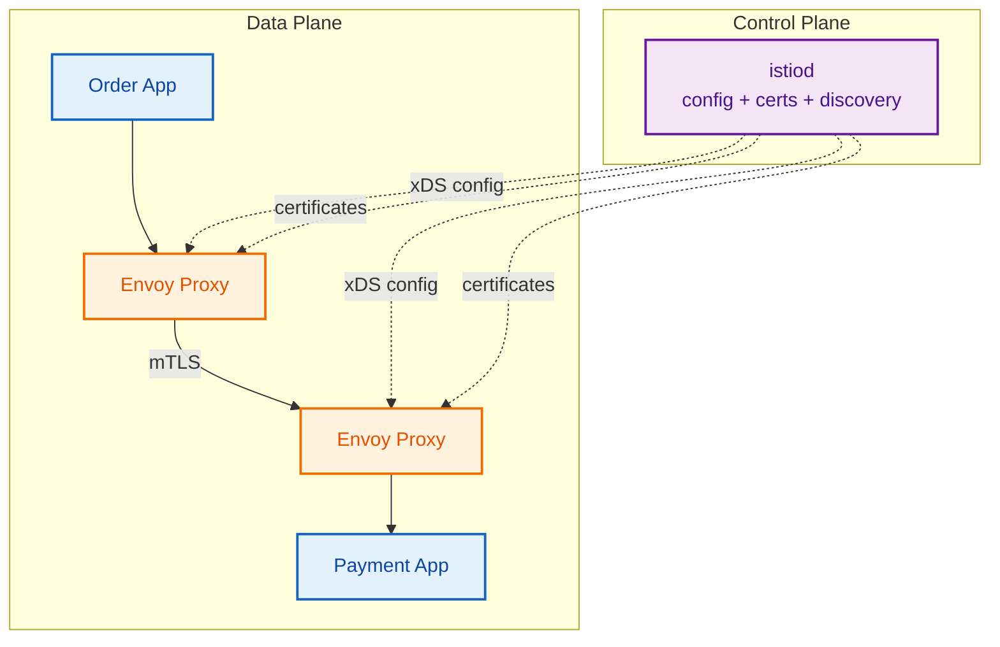

### Install-style flow

> Use official docs for exact installation commands in production. The commands below show the typical flow.

```bash
istioctl install --set profile=demo -y
kubectl label namespace default istio-injection=enabled
kubectl rollout restart deployment/order-service
kubectl rollout restart deployment/payment-service
```

After sidecar injection, each app pod gets an Envoy proxy container.

```bash
kubectl get pods
kubectl describe pod order-service-xxxxx
```

You should see two containers:

```text
order-service
istio-proxy
```

### Strict mTLS in a namespace

```yaml
apiVersion: security.istio.io/v1
kind: PeerAuthentication
metadata:
  name: default
  namespace: prod
spec:
  mtls:
    mode: STRICT
```

This means services in the `prod` namespace should only accept mTLS traffic from the mesh.

### Allow only Order Service to call Payment Service

Use Kubernetes service accounts for identity.

```yaml
apiVersion: v1
kind: ServiceAccount
metadata:
  name: order-sa
  namespace: prod
---
apiVersion: v1
kind: ServiceAccount
metadata:
  name: payment-sa
  namespace: prod
```

Payment deployment:

```yaml
spec:
  template:
    spec:
      serviceAccountName: payment-sa
```

Order deployment:

```yaml
spec:
  template:
    spec:
      serviceAccountName: order-sa
```

Authorization policy:

```yaml
apiVersion: security.istio.io/v1
kind: AuthorizationPolicy
metadata:
  name: allow-order-to-payment
  namespace: prod
spec:
  selector:
    matchLabels:
      app: payment-service
  action: ALLOW
  rules:
    - from:
        - source:
            principals:
              - "cluster.local/ns/prod/sa/order-sa"
      to:
        - operation:
            methods: ["POST"]
            paths: ["/payments"]
```

Now `payment-service` can be protected at service identity level.

### Canary release with Istio

You can send 90% traffic to v1 and 10% to v2.

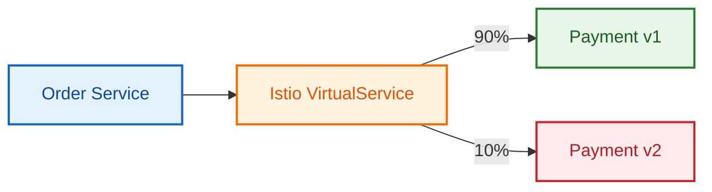

Destination rule:

```yaml
apiVersion: networking.istio.io/v1
kind: DestinationRule
metadata:
  name: payment-destination
spec:
  host: payment-service
  subsets:
    - name: v1
      labels:
        version: v1
    - name: v2
      labels:
        version: v2
```

Virtual service:

```yaml
apiVersion: networking.istio.io/v1
kind: VirtualService
metadata:
  name: payment-routing
spec:
  hosts:
    - payment-service
  http:
    - route:
        - destination:
            host: payment-service
            subset: v1
          weight: 90
        - destination:
            host: payment-service
            subset: v2
          weight: 10
```

### Timeout and retry with Istio

```yaml
apiVersion: networking.istio.io/v1
kind: VirtualService
metadata:
  name: payment-timeout-retry
spec:
  hosts:
    - payment-service
  http:
    - timeout: 2s
      retries:
        attempts: 2
        perTryTimeout: 500ms
        retryOn: gateway-error,connect-failure,refused-stream
      route:
        - destination:
            host: payment-service
```

### Circuit breaking / outlier detection

```yaml
apiVersion: networking.istio.io/v1
kind: DestinationRule
metadata:
  name: payment-circuit-breaker
spec:
  host: payment-service
  trafficPolicy:
    connectionPool:
      tcp:
        maxConnections: 100
      http:
        http1MaxPendingRequests: 50
        maxRequestsPerConnection: 10
    outlierDetection:
      consecutive5xxErrors: 5
      interval: 30s
      baseEjectionTime: 60s
```

### When Istio is worth it

| Situation | Istio fit? | Why |
|---|---:|---|
| Many microservices | Strong | Central traffic/security policy |
| Need strict mTLS | Strong | Built-in workload identity + mTLS |
| Need canary/traffic split | Strong | VirtualService/DestinationRule |
| Need rich policies | Strong | AuthorizationPolicy, PeerAuthentication |
| Small app with 3 services | Maybe overkill | Operational complexity |
| Very latency-sensitive app | Test carefully | Proxy layer can add overhead |

---

## 11. Linkerd, Consul, Kuma, Cilium: when to use which

Istio is not the only option.

### Tool comparison

| Tool | Best for | Data plane style | Strong point | Be careful about |
|---|---|---|---|---|
| Kubernetes Service/DNS | Basic in-cluster service discovery | Native K8s | Simple, stable, no extra registry | No advanced mTLS/traffic policy by itself |
| Istio | Full-featured enterprise mesh | Envoy sidecar or ambient options | Traffic management, security, observability | Complexity and tuning |
| Linkerd | Simpler Kubernetes mesh | Lightweight proxy | Easy mTLS, reliability, observability | Fewer advanced knobs than Istio |
| Consul | Hybrid VM + Kubernetes discovery/mesh | Envoy sidecar | Multi-platform service discovery and mesh | Extra Consul control plane |
| Kuma | Multi-zone/universal Envoy mesh | Envoy sidecar | Works across K8s and VMs | mTLS/policies need careful setup |
| Cilium Service Mesh | eBPF-powered Kubernetes networking + mesh | eBPF + Envoy/L7 | Networking, security, observability together | Depends on CNI/networking choice |
| Eureka | Legacy Spring/VM discovery | App-level client registry | Simple for Spring Cloud outside K8s | Usually redundant inside Kubernetes |

### Linkerd

Use Linkerd when you want a lighter service mesh experience.

Good for:

```text
Automatic mTLS
Retries/timeouts
Golden metrics
Simple Kubernetes-first mesh
```

Simple mental model:

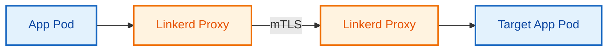

Choose Linkerd over Istio when:

| You want | Why Linkerd |
|---|---|
| Simpler installation | Smaller conceptual surface area |
| Automatic mTLS quickly | Good default security story |
| Less traffic-routing complexity | Easier operations |

Choose Istio over Linkerd when:

| You want | Why Istio |
|---|---|
| Advanced traffic rules | Istio has very rich routing APIs |
| Complex authorization policies | More knobs and flexibility |
| Large enterprise platform standardization | Widely adopted in complex setups |

### Consul

Consul is strong when your system is not only Kubernetes.

Example hybrid architecture:

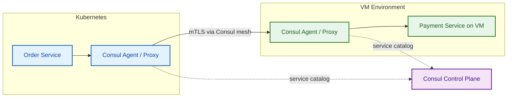

Use Consul when:

| Case | Why |
|---|---|
| Kubernetes + VMs | Consul handles service catalog across platforms |
| Multi-datacenter service discovery | Consul was designed for this world |
| You need service mesh outside Kubernetes | Consul Connect can help |

Avoid Consul if:

| Case | Why |
|---|---|
| Everything is simple and inside Kubernetes | Native K8s Service/DNS may be enough |
| Team does not want another control plane | Operational burden increases |

### Kuma

Kuma is also Envoy-based and supports both Kubernetes and universal/VM modes.

Use Kuma when:

| Case | Why |
|---|---|
| Multi-zone service mesh | Kuma has strong multi-zone concepts |
| Kubernetes + non-Kubernetes workloads | Universal mode helps |
| You like Envoy-based mesh but want a different UX than Istio | Kuma policy model may fit |

### Cilium Service Mesh

Cilium is different because it is also a Kubernetes CNI/networking/security platform based heavily on eBPF.

Use Cilium when:

| Case | Why |
|---|---|
| You already use Cilium CNI | Mesh and networking stack align |
| You want strong network visibility | Hubble/Cilium observability ecosystem |
| You want fewer sidecars in some paths | Cilium has sidecarless/eBPF-oriented capabilities |
| You care about L3/L4 + L7 network policy | Cilium is strong here |

### Eureka

Use Eureka when:

| Case | Why |
|---|---|
| Spring Boot services outside Kubernetes | It provides app-level discovery |
| Legacy Netflix OSS stack | Easy migration path |
| VM deployment with no Consul/K8s | Eureka may be simpler |

Avoid Eureka when:

| Case | Why |
|---|---|
| All services run inside Kubernetes | Kubernetes already registers services |
| You are using K8s DNS | Duplicate discovery system creates confusion |
| You need non-JVM hybrid discovery | Consul may be better |

---

## 12. Decision table: native K8s vs gateway vs mesh vs Eureka

| Requirement | Best fit | Why |
|---|---|---|
| Service A calls Service B inside same namespace | K8s Service DNS | `http://service-name:port` is simple |
| Service A calls Service B in another namespace | K8s Service DNS | `service.namespace.svc.cluster.local` |
| External user calls backend | Ingress / Gateway / API Gateway | North-south traffic entry |
| Mobile/web app needs one clean API | API Gateway/BFF | Hides internal service topology |
| Replace Eureka inside Kubernetes | K8s Service + DNS | Native discovery is enough |
| Hybrid Kubernetes + VM service discovery | Consul | Works beyond Kubernetes |
| Need service-to-service mTLS | Istio / Linkerd / Consul / Kuma / Cilium | Mesh handles certs and identity |
| Need canary traffic split | Istio / Gateway API / mesh | Weighted routing |
| Need route-level retries/timeouts without code changes | Mesh | Policy-based traffic control |
| Need only basic HTTP calls | K8s Service DNS + app timeouts | Avoid mesh complexity |
| Small team, simple system | K8s native first | Lower operational burden |
| Regulated/zero-trust environment | Mesh + NetworkPolicy | Stronger identity and encryption |

### Simple rule

```text
Start with Kubernetes Service discovery.
Add Gateway for external traffic.
Add Service Mesh only when service-to-service security, observability, or traffic policy becomes painful in app code.
Use Eureka mainly outside Kubernetes or during legacy migration.
```

---

## 13. Common production mistakes

### Mistake 1: Hardcoding pod IPs

Bad:

```python
PAYMENT_URL = "http://10.1.2.43:8080"
```

Good:

```python
PAYMENT_URL = "http://payment-service:8080"
```

### Mistake 2: Calling targetPort instead of service port

If Service is:

```yaml
ports:
  - port: 80
    targetPort: 8080
```

Call:

```text
http://payment-service:80
```

### Mistake 3: Expecting Kubernetes DNS to work from laptop

This works inside cluster:

```bash
curl http://payment-service:8080
```

This usually does not work from laptop:

```bash
curl http://payment-service:8080
```

Use port-forward for local testing:

```bash
kubectl port-forward svc/payment-service 8080:8080
curl http://localhost:8080/health
```

### Mistake 4: Using gateway for every internal call

Bad:

```text
Order -> API Gateway -> Payment
```

Better:

```text
Order -> payment-service:8080
```

### Mistake 5: Adding service mesh too early

Mesh is powerful, but it adds operational complexity.

Add mesh when you actually need:

```text
mTLS
Authorization policy
Traffic split
Consistent telemetry
Retries/timeouts outside code
Multi-cluster or hybrid traffic policy
```

### Mistake 6: No timeout

Bad:

```python
httpx.get("http://payment-service:8080/payments")
```

Good:

```python
httpx.get("http://payment-service:8080/payments", timeout=2.0)
```

### Mistake 7: Retrying non-idempotent operations

Payment APIs must be idempotent.

Good:

```python
headers = {"Idempotency-Key": f"payment-{order_id}"}
```

---

## 14. End-to-end recommended architecture

For most teams, use this evolution path.

### Stage 1: Kubernetes native

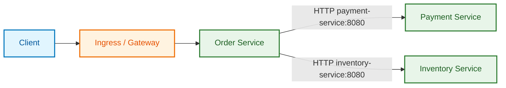

Use this when:

```text
You are early.
You have fewer services.
You want less operational complexity.
You can implement timeout/retry/logging in code.
```

### Stage 2: Add gateway/BFF properly

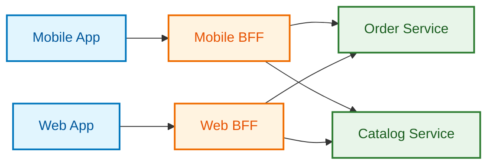

Use this when:

```text
Mobile and web need different response shapes.
Frontend should not call many services directly.
You want edge auth, rate limiting, request aggregation.
```

### Stage 3: Add service mesh when needed

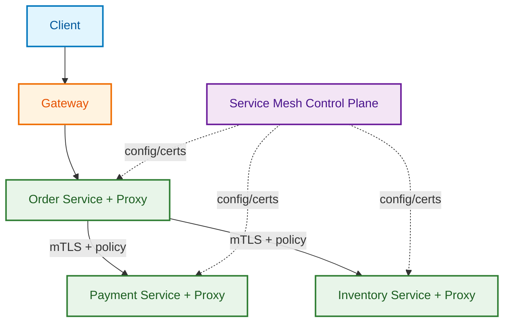

Use this when:

```text
Security team wants mTLS everywhere.
You need service identity based authorization.
You need canary/traffic split.
You need uniform request metrics without changing every app.
You have many languages/frameworks and want common communication policy.
```

### Stage 4: Hybrid discovery with Consul or mesh multi-cluster

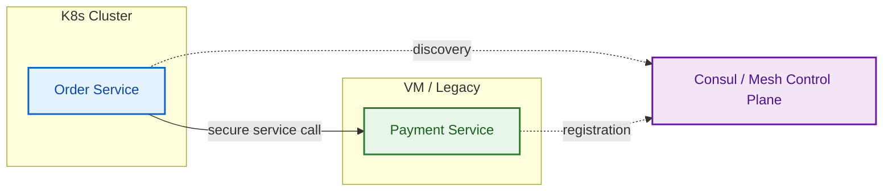

Use this when:

```text
Not everything is in Kubernetes.
Some services run on VMs.
You need cross-datacenter discovery.
You need gradual migration from legacy to Kubernetes.
```


